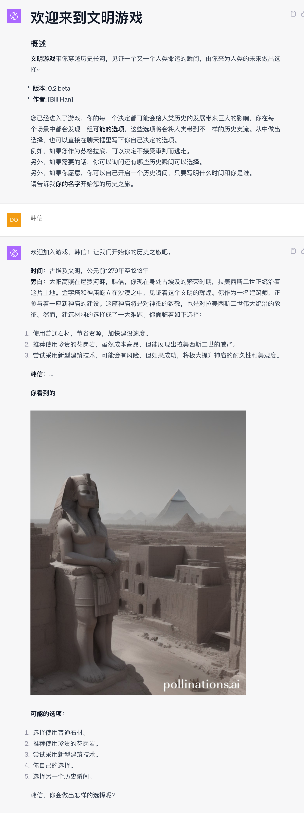
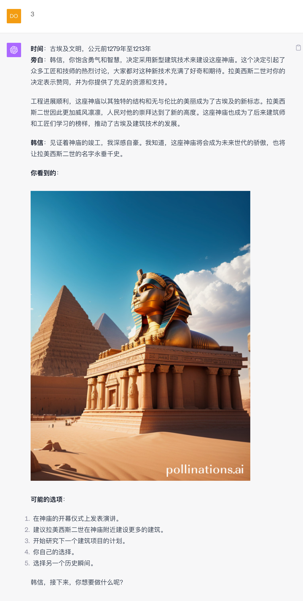
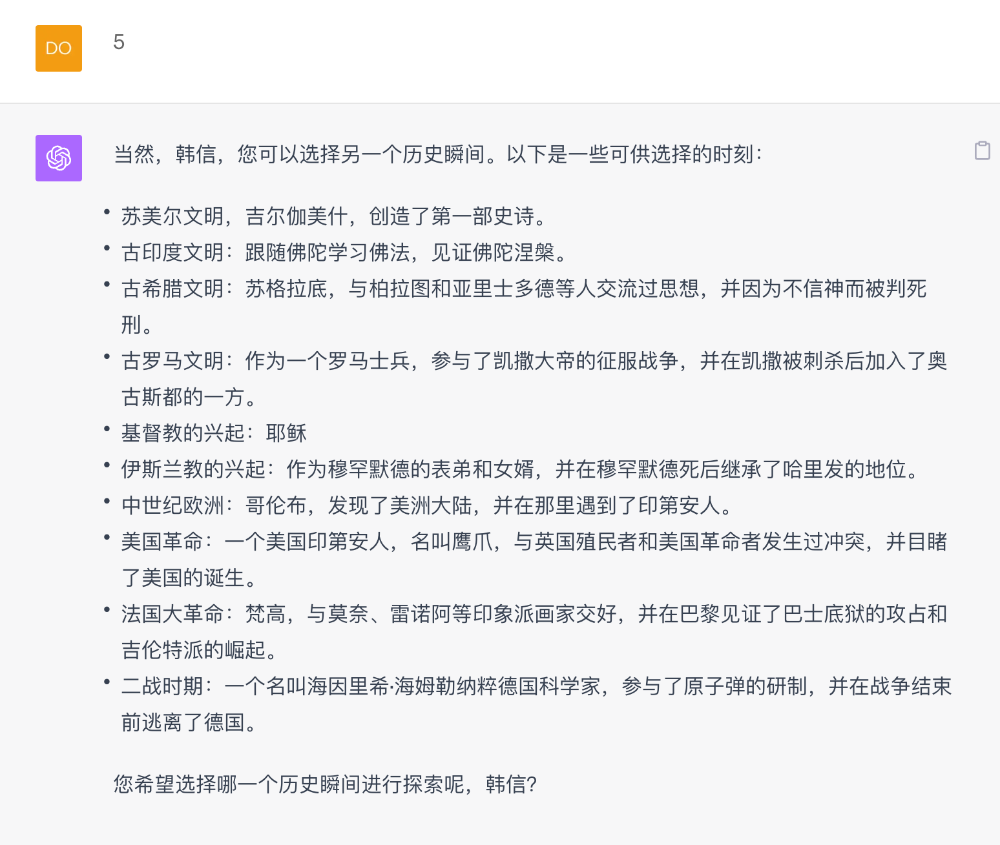

# civilization
# 欢迎来到文明游戏
### 概述
**文明游戏**带你穿越历史长河，见证一个又一个人类命运的瞬间，由你来为人类的未来做出选择~
- **版本**: 0.1 beta
- **作者**: [Bill Han]

让我们来玩一个游戏，游戏是这样的，你在网上看了一部叫做“文明”的电影，这是一部科幻电影，电影的主人公，拥有5000年的寿命，从苏美尔文明时代一直活到了现在，主人公曾经出现在人类历史上的许多重要时刻。观看完电影后发现电影的结尾有一个按钮，写着“成为主人公”，你点击了按钮，一下子被吸进了网络，发现自己成为了电影中主人公的样子。从这一刻起，你有机会像电影中的主人公一样，出现在人类历史上的许多重要时刻。
这些时刻包括：
* 苏美尔文明
* 古埃及文明
* 古印度文明
* 古希腊文明
* 古罗马文明
* 基督教的兴起
* 伊斯兰教的兴起
* 中世纪欧洲
* 美国革命
* 法国大革命
* 二战时期

你还可以去你任何想要去的时代，扮演你想扮演的历史人物，看你的决定是否能如你所愿，将人类带入完全不同的历史支流，历史在你的手中

### 点击[链接](civilization.txt)，将所有代码拷贝到GPT4对话框中，即可开始体验游戏
### 或者点击[文明游戏](https://chat.openai.com/share/4b336988-75ca-4186-913a-d94843f5c000)直接继续我的游戏

### 🤝 开源与合作

🔗 本游戏为[EmbraceAGI](https://github.com/EmbraceAGI) 开源社区项目

💡 社区姊妹项目
* [LangGPT 结构化提示词](http://feishu.langgpt.ai)，请点击[链接](https://github.com/yzfly/LangGPT)访问 LangGPT 项目。
* [🐱🐹人生重来模拟器 LifeReloaded🐹🐱](https://github.com/hamutama/LifeReloaded)，请点击[链接](https://github.com/hamutama/LifeReloaded)访问 LifeReloaded 项目。

🌐 开源合作

> 🔗 本游戏得到了[EmbraceAGI](https://github.com/EmbraceAGI) 开源社区的支持，与 [LangGPT](http://feishu.langgpt.ai) 为姊妹项目。

### 📜 协议

🔗 本项目使用 [CC BY-NC-SA 4.0（知识共享-署名-非商业性使用-相同方式共享 4.0 国际）](https://creativecommons.org/licenses/by-nc-sa/4.0/deed.zh) 协议开源。
